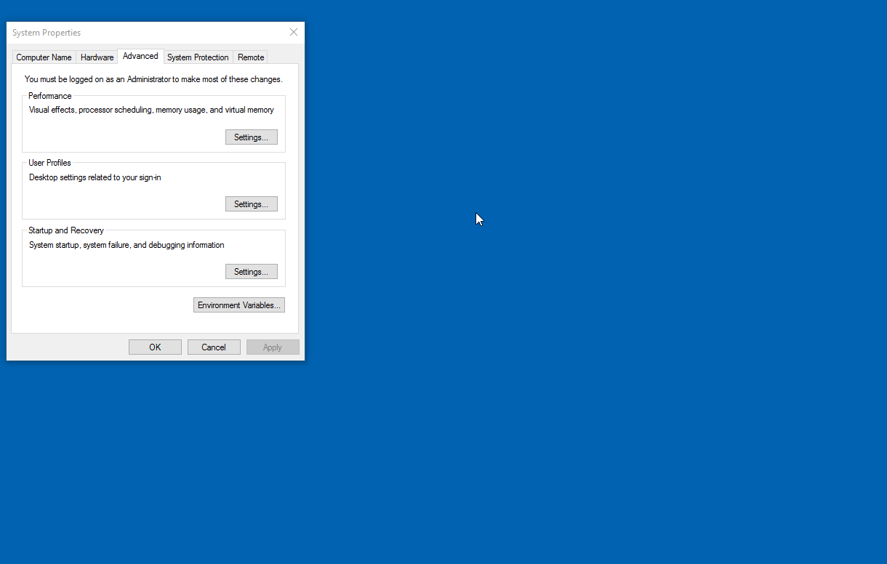
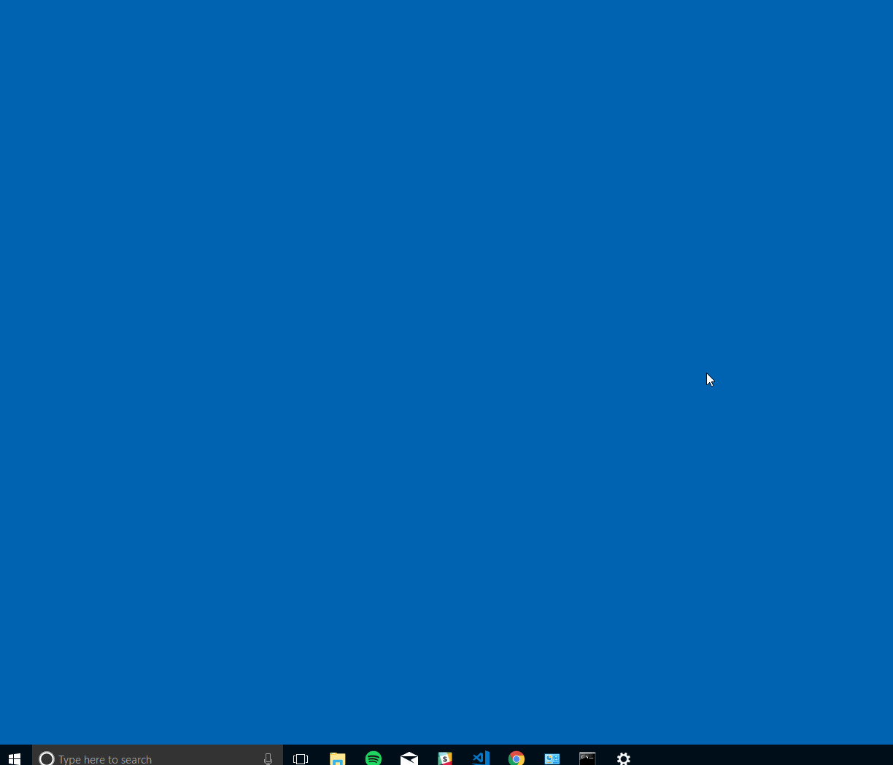

# csv-to-css

## Purpose

This tool takes a published CSV document, converts it into a CSS file, determines if it's valid CSS and writes it to the hard-drive. If the CSS is not valid, it will write a JSON file containing the errors.  


## How to Install

1. Make sure [NodeJS](https://nodejs.org/en/) is downloaded and current
2. Set Path environment variable if it's not already done
    * Windows button on keyboard
    * Type Environment Variables

    


    * Add `%USERPROFILE%\AppData\Roaming\npm;` to the User Path

    
    

#### Full Process


Open the console and type:

```
npm install -g byuitechops/csv-to-css
```


## How to Run

* Make sure the `settings.json` file is set correctly


* Navigate to the folder where you want the CSS saved

```js
csvToCss
```


### Inputs

**CSV URL**

Input the URL for the published google sheet where your csv data is.

**CSV Document Format**

* CourseCode and department are required. All other properties are optional
* If there is customCSS, it needs to be valid when inputted

| @courseName | @lastEditedBy | @lastEditDate | @professorName | courseCode | department | --color1 | --color24 | --color35 | --button-color | customCSS |
|-------------|---------------|---------------|----------------|------------|------------|----------|-----------|-----------|----------------|-----------|
|Intergalactic Warfare | Lord Vader | 6/5/2120 | Darth Sidious | GW350 | Sith |  Black | Red |White  || .deathStar{ color: grey; } |
|Singing: Screamo | This guy |  | Ring Wraith | MUS200 | Mordor Management | | Black | Grey | |

**Settings**

* url: The url to the _published_ document  
* name: Your desired folder name
* extraCss: Filename of any extra CSS rules you want included in your file. Can be blank.
* departmentHash: An object containing the md5 hash for each seperate department

```json
[
    {
        "url": "https://docs.google.com/spreadsheets/validresource",
        "name": "Campus",
        "extraCss": "aFileToAppend.css",
        "departmentHash": {
            "Sith": "HashingGoodness",
            "Mordor Management": "OtherSuchHashingStuffs"
        }
    },
    {
        "url": "https://docs.google.com/spreadsheets/validresource",
        "name": "Online",
        "extraCss": "",
        "departmentHash": {"Blank object"}
    },
    {
        "url": "https://docs.google.com/spreadsheets/othervalidthings",
        "name": "Pathway",
        "extraCss": "extraFile.css",
        "departmentHash": {}
    }
]
```


### Outputs

A log will be given of what happens during execution.  
If the CSS is invalid, the file will not be written. Instead a JSON file is written containing the errors.

```js
// Valid CSS
style.css written

// Invalid CSS
Check cssfile.css for errors
cssfile.css_errors.json written
```

## Requirements

* Read the CSV from a published google sheet
* If there is an empty property in the CSV, it will be skipped when converted to CSS
* Output valid CSS documents
* Log any CSS errors in a JSON document

## Development

### Execution Process

#### Read in settings
Read the settings file and return an array containing objects with `url` and `filePath` properties

#### Retrieve and manipulate the data
Use the URL in the settings object to retrieve the CSV data and convert it to CSS.

#### Validation
Check whether the CSS is valid.  

_**if valid**_

Write the valid, formatted CSS to a file named `${file.department}.css`


_**if not valid**_

Write a JSON file named `${file.department}_errors.json` containing any errors in the CSS

